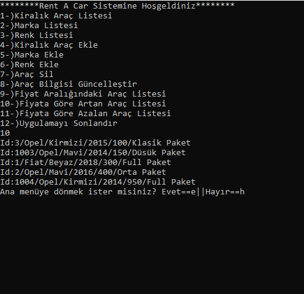
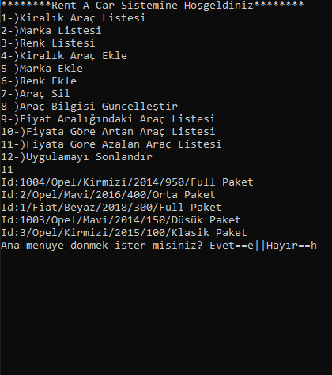
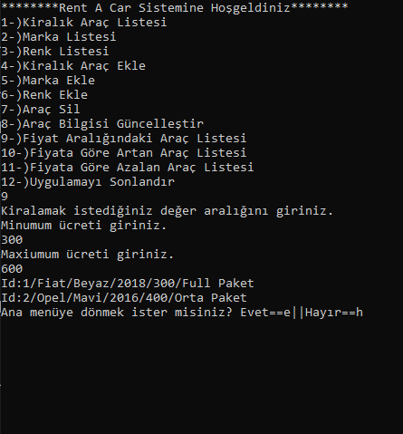

# ReCapProject
#  Ödev 1
Not : İsteyenler Northwind projesindeki Core katmanını da ekleyebilir ama pekiştirmek için yeniden yazmanızı öneririm. Bu şekilde yapmak isteyenler CarRental/Solution Explorer Sağ Tık / Add /Existing Project/ Northwind içindeki Core klasöründe Core.csproj dosyasını ekleyebilirler. Bu şekilde yapanlar aşağıdaki 3. adımdan devam edebilirler.

Önerim aşağıdaki gibi yeniden yapmanızdır.

CarRental Projenizde Core katmanı oluşturunuz.
IEntity, IDto, IEntityRepository, EfEntityRepositoryBase dosyalarınızı 9. gün dersindeki gibi oluşturup ekleyiniz.
Car, Brand, Color sınıflarınız için tüm CRUD operasyonlarını hazır hale getiriniz.
Console'da Tüm CRUD operasyonlarınızı Car, Brand, Model nesneleriniz için test ediniz. GetAll, GetById, Insert, Update, Delete.
Arabaları şu bilgiler olacak şekilde listeleyiniz. CarName, BrandName, ColorName, DailyPrice. (İpucu : IDto oluşturup 3 tabloya join yazınız)
Kodlarınızı Github hesabınızda paylaşıp link veriniz.
Başkalarının kodlarını inceleyiniz. Beğenirseniz yıldız veriniz.
#
Cor Katmanı Oluşturuldu✓

IEntity,IDto,IEntityRepository,
EfEntityRepositoryBase oluşturuldu✓

Car, Brand, Color sınıfları için CRUD operasyonları hazır hale getirildi✓

Console'da Tüm CRUD operasyonları Car, Brand, Model nesneleri için test edildi✓

Join işlemleri yazılıp Car bilgileri listelendi✓

#

# Bunların Dışında

Menü Eklendi✓

Menüler Arasında Geçiş Eklendi(Programı sonlandırmadan ana menüye  geri dönmek)✓

Try-Catch bloğu ile kontrol sağlandı✓

Fiyat aralığı ile listeleme işlemi eklendi✓

Fiyata göre artan ve azalan listeleme işlemi eklendi✓

#

#

#

#

